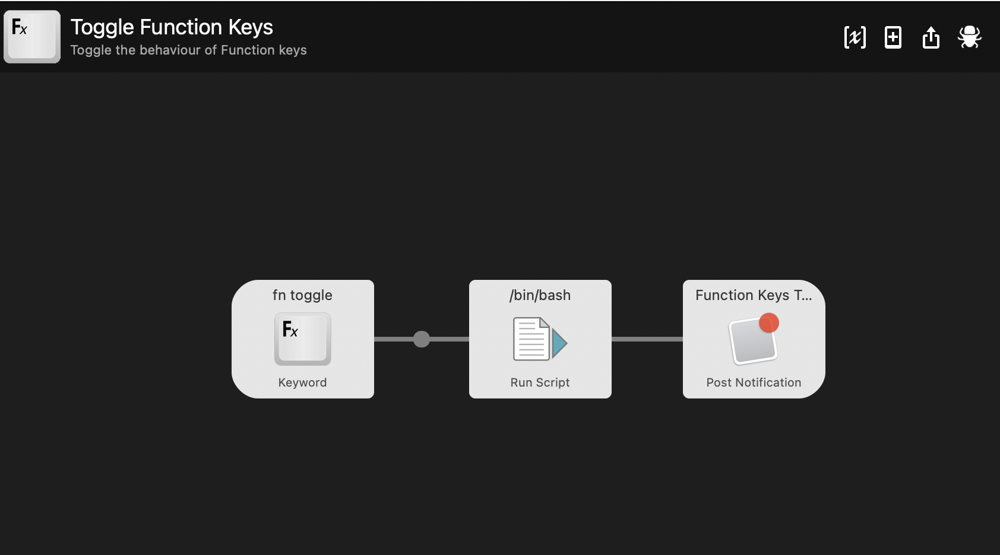

# Alfred: Toggle Fn Function Keys On/Off in OSX Catalina+

Simple Alfred Script to toggles Function Keys in OSX Catalina using Apple Script  

### Requirements

[Alfred 4.](https://www.alfredapp.com/)

### Install

Download [Toggle Function Keys.alfredworkflow](https://github.com/stirtingale/Alfred---Toggle-Function-Keys-On-Of/raw/master/Toggle%20Function%20Keys.alfredworkflow). Open file and import into Alred.


Use `fn toggle` as keyword to trigger the toggle. 



Or from command line

```bash
# bash
osascript ToggleFunction.scpt
```
